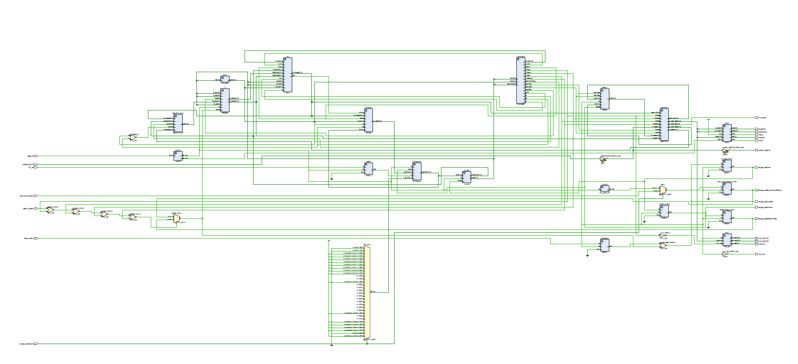
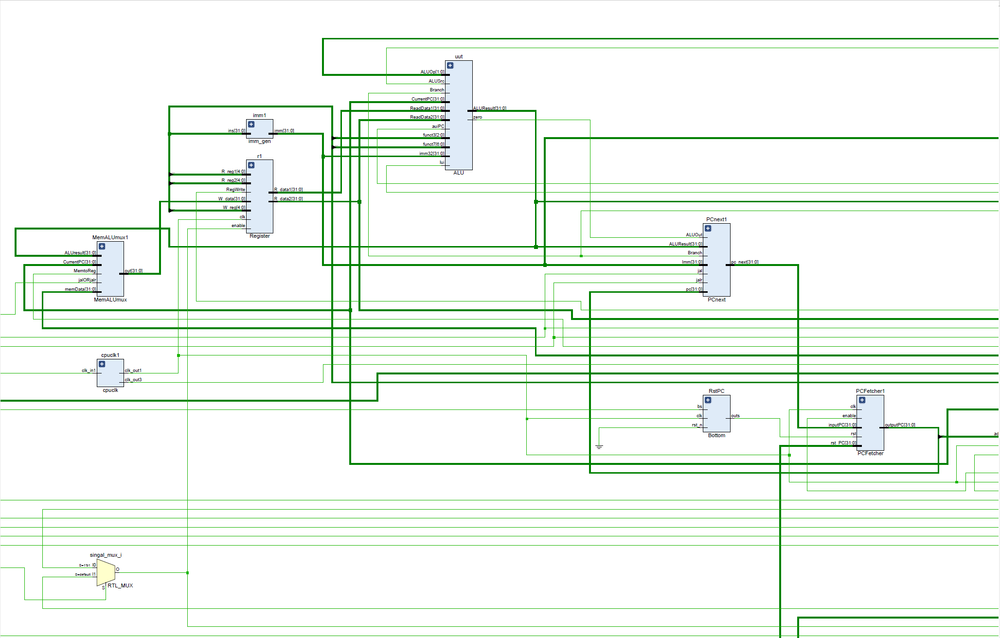
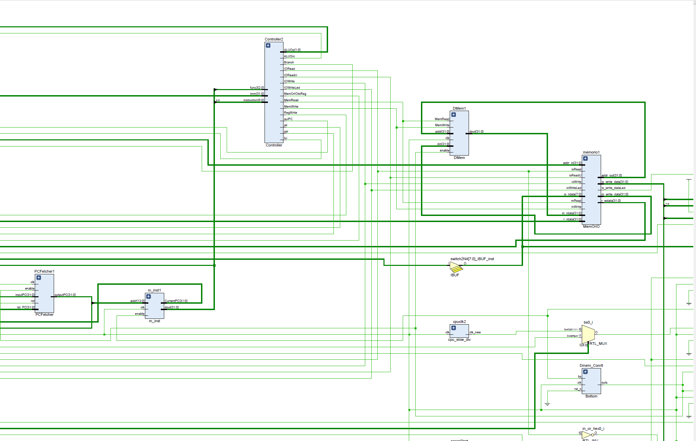

# 计算机组成原理project报告
本报告为计算机组成原理CPU设计project的说明，第一部分为基本功能部分，第二部分为bonus相关部分
# 基本功能部分

## 开发者说明
| 学号     | 姓名   | 分工                              | 贡献比 |
| -------- | ------ | --------------------------------- | ------ |
| 12211026 | 冯秋皓 | 报告攥写、CPU_TOP模块设计、IP核相关模块设计                | 33.33% |
| 12210830 | 郑轶滔 | 项目测试、多个模块设计、IO方案设计                | 33.33% |
| 12210707 | 史卓宇   | 汇编代码、ALU | 33.33% |
## 开发计划日程安排和实施情况

| 时间          | 任务                                         |
| ------------- | -------------------------------------------- |
| 4月29日         | 商讨project计划                                 |
| 4月30日-5月5日 | 熟悉Project 内容                      |
| 5月6日         | TOP模块基本方案成型，部分模块定义并实现 |
| 5月11日 | 小组讨论共同设计基础模块                           |
| 5月13日         | TOP模块基本完成，其余各模块大部分完成                           |
| 5月18日         | 小组讨论共同检查设计，纠错                                     |
| 5月20日         | 基础部分初版本完成，开始进行测试和bonus实现                             |
| 5月23日         | 小组讨论进行验收                              |
| 5月26日         | 紧急修复未发现的bug                                 |
| 5月27日         | 答辩                                 |

**以上计划均按时完成**

## CPU架构设计说明
### CPU特性
#### ISA、寄存器、异常处理
| 指令名 | 对应编码 | 使用方式 |
|-------|---------|-----------|
|add|

寄存器位宽32bits，数目32个，其中x0寄存器始终为0

异常处理：输入数据错误时，通过一个循环之后可以重新输入
#### CPU时钟、CPI、周期
CPU时钟为23MHz，CPI为3，多周期CPU，不支持pipeline
#### 寻址空间设计
采用哈佛结构，将指令的内存和数据的内存独立开来，两个内存大小均为32宽*16384深。
#### 对外设IO的支持
我们采用MMIO模块。MMIO模块相当于一个选择器，有来自ALU、内存、以及外部拨码开关的输入；对应的输出有寄存器、内存、以及来自外部的数码管。

在每条指令执行种，决定一个输入源和一个输出源。

为方便与外部IO设备相接，在ISA指令中，lw的内存地址为-1和-2分别对应有符号输入和无符号输入；sw的内存地址-1和-2分别对应的是显示到数码管和单个led中（这个led灯是用来显示第一个测试用例中有关Branch部分的比较结果）。
### CPU接口
时钟接入EGO1开发板自带的100MHz时钟，再通过IP核进行分频；S4按钮可重置PC值，相当于执行新样例时的复位信号；无uart接口；8个小拨码开关作为测试数据的输入，其余的拨码开关作为测试样例编号的输入、开始信号的输入以及16bits数据输入时，高八位与低八位数据输入的调整。

八个八位数码管显示结果，左侧八个led灯显示当前输入测试数据的值，右边八个led灯的最右侧led灯作为测试结果的信号输出。
### CPU内部结构
#### CPU内部各子模块的接口连接关系图

由于图片过大，只将两个关键部分放大展示

#### CPU内部子模块的设计说明
CPU_TOP 模块
端口规格：
输入：
PC_rst (1位)：程序计数器复位信号。
fpga_clk (1位)：来自FPGA的时钟信号。
switch2N4 (8位)：8位输入开关。
start_buttom (1位)：启动CPU的按钮。
userIO_switch (1位)：用户I/O切换开关。
click_input_buttom (1位)：输入按钮。
chosen_switch (5位)：选择开关的5位输入。
输出：
tub (8位)：用于显示控制。
tub_ctr1 (8位)：用于显示控制。
tub_ctr2 (8位)：用于显示控制。
cpu_clk (1位)：CPU时钟信号。
singal_startInst (1位)：控制信号。
singal_startDmem (1位)：控制信号。
singal_startWriteToReg (1位)：控制信号。
singal_press_clickinputButtom (1位)：控制信号。
singal_start_switch (1位)：控制信号。
Compare (1位)：比较结果输出信号。
check_inst (8位)：用于检查指令。
hsync (1位)：VGA行同步信号。
vsync (1位)：VGA场同步信号。
red (4位)：VGA红色信号。
green (4位)：VGA绿色信号。
blue (4位)：VGA蓝色信号。

Bottom 模块
端口规格：
输入：
clk (1位)：时钟信号。
button (1位)：按钮信号。
rst (1位)：复位信号。
输出：
signal (1位)：控制信号。

cpuclk 模块
端口规格：
输出：
clk_out1 (1位)：输出时钟信号1。
clk_out2 (1位)：输出时钟信号2。
clk_out3 (1位)：输出时钟信号3。
输入：
clk_in1 (1位)：输入时钟信号。

cpu_slow_div 模块
端口规格：
输入：
clk_in (1位)：输入时钟信号。
输出：
clk_out (1位)：输出慢时钟信号。

PCFetcher 模块
端口规格：
输入：
clk (1位)：时钟信号。
pc_next (32位)：下一个PC值输入。
start (1位)：启动信号。
rst (1位)：复位信号。
PC_Adr (32位)：PC地址输入。
输出：
outputPC (32位)：当前PC值输出。

m_inst 模块
端口规格：
输入：
clk (1位)：时钟信号。
addr (14位)：地址输入。
enable (1位)：使能信号。
输出：
dout (32位)：指令数据输出。
CurrentPC (32位)：当前PC输出。

imm_gen 模块
端口规格：
输入：
ins (32位)：指令输入。
输出：
imm (32位)：立即数输出。

ALU 模块
端口规格：
输入：
ReadData1 (32位)：读寄存器数据1。
ReadData2 (32位)：读寄存器数据2。
imm32 (32位)：立即数输入。
ALUOp (2位)：ALU操作码输入。
funct3 (3位)：指令功能码3。
funct7 (7位)：指令功能码7。
ALUSrc (1位)：ALU源选择信号。
Branch (1位)：分支信号。
CurrentPC (32位)：当前PC。
lui (1位)：LUI信号。
auiPC (1位)：AUIPC信号。
输出：
ALUResult (32位)：ALU结果输出。
zero (1位)：零标志。

PCnext 模块
端口规格：
输入：
pc (32位)：当前PC。
Branch (1位)：分支信号。
ALUOut (1位)：ALU零标志。
Imm (32位)：立即数。
ALUResult (32位)：ALU结果。
jal (1位)：JAL信号。
jalr (1位)：JALR信号。
输出：
pc_next (32位)：下一个PC值。
pc_next2 (32位)：备用下一个PC值。

MemALUmux 模块
端口规格：
输入：
MemtoReg (1位)：内存到寄存器选择信号。
memData (32位)：内存数据。
ALUresult (32位)：ALU结果。
jalORjalr (1位)：JAL或JALR信号。
CurrentPC (32位)：当前PC。
输出：
out (32位)：输出数据。

Controller 模块
端口规格：
输入：
instruction (7位)：指令操作码。
func3 (3位)：指令功能码3。
imm (32位)：立即数。
输出：
Branch (1位)：分支信号。
MemRead (1位)：内存读取信号。
MemOrIOtoReg (1位)：内存或I/O到寄存器选择信号。
MemWrite (1位)：内存写入信号。
ALUSrc (1位)：ALU源选择信号。
RegWrite (1位)：寄存器写入信号。
IORead (1位)：I/O读取信号。
IOWrite (1位)：I/O写入信号。
ALUOp (2位)：ALU操作码。
IOReadU (1位)：I/O读取上半部分信号。
IOWriteLed (1位)：I/O写入LED信号。
jal (1位)：JAL信号。
jalr (1位)：JALR信号。
lui (1位)：LUI信号。
auiPC (1位)：AUIPC信号。

MemOrIO 模块
端口规格：
输入：
mRead (1位)：内存读取信号。
mWrite (1位)：内存写入信号。
ioRead (1位)：I/O读取信号。
ioWrite (1位)：I/O写入信号。
addr_in (32位)：地址输入。
m_rdata (32位)：内存数据输入。
io_rdata (8位)：I/O数据输入。
r_rdata (32位)：读取数据输入。
ioReadU (1位)：I/O读取上半部分信号。
输出：
addr_out (32位)：地址输出。
r_wdata (32位)：写入数据输出。
m_write_data (32位)：内存写入数据输出。
LEDCtrl (1位)：LED控制信号。
SwitchCtrl (1位)：开关控制信号。
io_write_data (32位)：I/O写入数据。
io_write_dataLed (1位)：I/O写入LED数据。

DMem 模块
端口规格：
输入：
clk (1位)：时钟信号。
MemRead (1位)：内存读取信号。
MemWrite (1位)：内存写入信号。
addr (14位)：地址输入。
din (32位)：写入数据。
enable (1位)：使能信号。
输出：
dout (32位)：数据输出。

Register 模块
端口规格：
输入：
clk (1位)：时钟信号。
RegWrite (1位)：寄存器写使能信号。
R_reg1 (5位)：读取寄存器地址1。
R_reg2 (5位)：读取寄存器地址2。
W_reg (5位)：写入寄存器地址。
W_data (32位)：写入数据。
enable (1位)：使能信号。
输出：
R_data1 (32位)：读取数据1。
R_data2 (32位)：读取数据2。

tube_top 模块
端口规格：
输入：
clk (1位)：时钟信号。
hex (16位)：16进制数据。
in_or_hex (1位)：输入或16进制选择信号。
输出：
out_sel (8位)：显示选择输出。
out_con1 (8位)：显示控制输出1。
out_con2 (8位)：显示控制输出2。

VGA 模块
端口规格：
输入：
vga_clk (1位)：VGA时钟信号。
rst_n (1位)：复位信号（低有效）。
script (32位)：脚本数据。
in_bits (32位)：输入位数据。
输出：
out_bits (32位)：输出位数据。
hsync (1位)：行同步信号。
vsync (1位)：场同步信号。
red (4位)：红色信号。
green (4位)：绿色信号。
blue (4位)：蓝色信号。
## 系统上板使用说明

## 自测试说明
| 测试内容 | 测试方法 | 测试类型 | 测试用例描述 | 测试结果 | 测试结论 |
|---------|---------|--------------|--------|-----------|---------|
|CPU_TOP| 上板 | 集成 | 所有符合ISA条件的指令 | 通过 | CPU_TOP架构正常|
| 输出 | 上板 | 单元 | 不同的计算结果及输入数据 | 通过 | 输出无异常 |
| IFetch | 仿真 | 单元 | 不同的PC值及不同指令(beq等) | 通过 | 下一PC值可正常获取|
| Dmem | 仿真 | 单元 | 大量数据 | 通过 | 该模块可正常存取数据 |
| 立即数生成单元 | 仿真 | 单元 | 不同包含立即数的指令 | 通过 | 可生成正确数据 |
| ALU | 仿真 | 单元 | 不同运算指令及数据 | 通过 |计算结果无误 |
| VGA | 上板 | 单元 | 与数码管输出内容相同 | 通过 | 可正常显示 |

## 问题及总结

# bonus相关部分
## VGA实现
### 设计思路及与周边模块的关系

### 核心代码及必要说明

## auipc及lui指令实现
### 设计思路及与周边模块的关系

### 核心代码及必要说明
